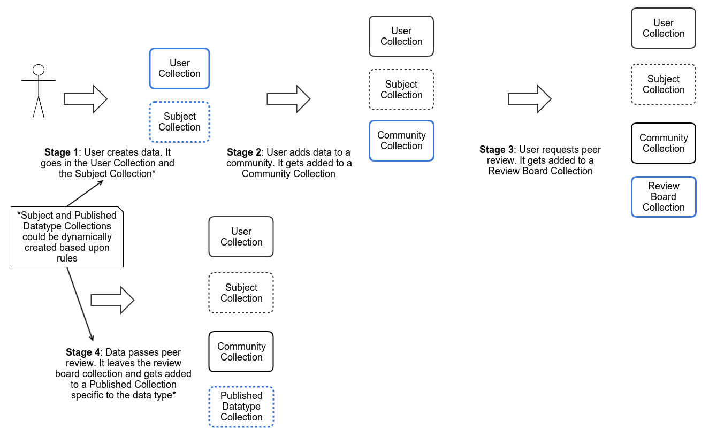
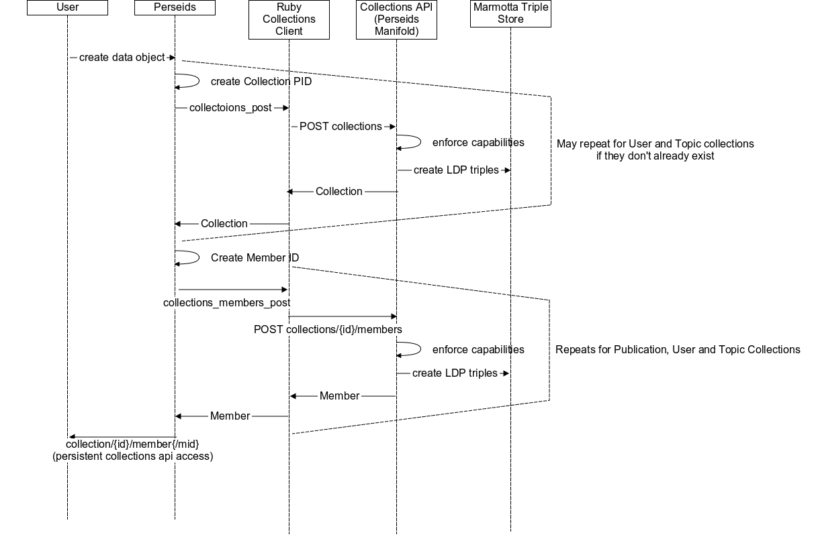
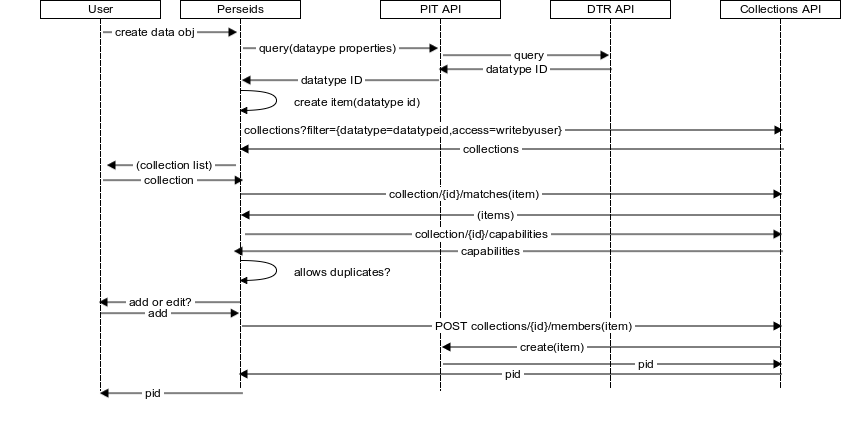

This document outlines ideas for future directions for Perseids, as of September, 2017.

## Taking Full Advantage of the Collections Service 

We have deployed and integrated the [Perseids Manifold Collections Service](https://github.com/RDACollectionsWG/perseids-manifold) implementation of the [RDA Collections API](https://github.com/RDACollectionsWG/specification) with Perseids.  

Expanding upon this implementation to provide complete support for managing and sharing data produced on Perseids as 
persistently identified, machine-actionable data throughout its lifecycle would be an ideal next step to take advantage of 
the groundwork that has beed laid in this area.

The use of the Collections Service is intended to support management of the data collection lifecylcle on Perseids as 
outlined below:

With the goal of eventually being able to support the following sorts of queries against all data created on Perseids:

* All data created by User X
* All data approved by Community X
* All treebank data for Homer’s Iliad Book 1 Lines 1-10
* All translation alignments of Homer’s Iliad Book 1, Lines 1-10
* All semantic annotations on Vergil’s Aeneid Book 1
* And so forth….

So far, just the following portion of the lifecycle support is implemented, for a subset of the data types available on Perseids (all *CiteIdentifiers):

The full goal for the Collection Service was to combine it with other RDA outputs -- the PID Types API (PIT) and the 
Data Types Registry (DTR) -- as well as a Handle Service to provide a means for persistent identification of all publications 
produced on Perseids as machine-actionable data objects adhering to standard, community accepted data types. This might 
require an interaction something like the following upon publication creation:

The [RPID Test Bed](https://rpidproject.github.io/rpid/) could be used to experiment with the viability of such an approach.

However, even in the absence of the full workflow with the ther RDA outputs, incremental improvements could be made to Perseids to take advantage of the use of the Collection Service integration.  For example, we could now begin to address [performance issues](https://github.com/perseids-project/perseids_docs/issues?utf8=%E2%9C%93&q=is%3Aissue%20is%3Aopen%20label%3Aperformance%20) with comparing and managing treebank publications by querying the collection service to find matching files more efficiently. (This may require manual import of data from prior to integration of the service to make sure all data on Perseids can be queried via the collections api).

Additional incremental steps involve using the Collection Service to facilitate management of Plokmas annotations, as described further below under [#plokamos-and-annotation-workflows)(#plokamos-and-annotation-workflows)

Another avenue possibly worth pursuing with regard to collections is leveraging the LDP model we have used for the annotations in the Perseids Manifold Collections service to facilitate their preservation in Fedora, which uses LDP for its collections as well.

See the following resources for more information on the RDA Collections API and Perseids:

Using the RDA Collections API to Shape Humanities Data. Presented at DH 2017 pre-conference workshop, “Shaping Humanities Data: Use, Reuse, and Paths Toward Computationally Amenable Cultural Heritage Collections,” August 2017. https://osf.io/3hcg8/

RDA Research Data Collections Wiki Pages: https://www.rd-alliance.org/groups/research-data-collections-wg.html

Adopting RDA Outputs in the Humanities, DH2016 https://docs.google.com/presentation/d/1tAG2lrcolPCiU6pQiBoddp7EQgE-mFZEmTvvoPHVMmc/pub?start=false&loop=false&delayms=3000

## Fuller Administration and End User Support

As described at [admin.md](admin.md) and in the [open issues](https://github.com/perseids-project/perseids_docs/issues?q=is%3Aissue+is%3Aopen+label%3AAdministration) fuller user interface support for some adminstrative activities on Perseids is needed in order for the platform to scale to support a larger number of projects and communities.  Areas to consider:

* development of an administrative interface for the [Flask Github Proxy](https://github.com/perseids-project/perseids_docs/blob/master/integrations/syriaca/flaskgithubproxy.md)
* enabling easier cleanup and removal of old unusused communities and boards
* managing changes to the terms of service
* development of an administrative interface for [Plokamos](https://github.com/perseids-project/plokamos) to manage ontologies and mappings (to easily enable the addition of community-specific and/or datatype-specific annotation ontologies)

In addition, there are a number of enhancements which could improve the user experience:

* enabling users to unsubscribe to emails and delete their own accounts
* an interface for creation, testing and deployment of new treebanking (Arethusa) tagsets
* the ability to incorporate user-provided corrections to morphological and lexical inventory data (for treebanking)

## Plokamos and Annotation Workflows

Plokamos is implemented as a plugin on the CapiTainS Nemo interface at (https://cts.perseids.org). Perseids SoSOL platform is used to authenticate users (via the [nemo-oauth-plugin](https://github.com/Capitains/nemo-oauth-plugin)) but the annotation data itself is not managed on SoSOL - it is just stored directly as graphs in the Marmotta quad store db.  The next logical steps for this would be to manage the Plokamos annotations on SoSOL.  

The original goals were to implement a bilateral annotation workflow which would allow for the annotation data to be kept for easy querying in the quad store, but have versioning and review managed on Perseids.  

Notes on how to approach to this:

* when an annotation is created on Plokamos, use the Perseids API to create a new publication document in SoSOL
* creation of a publication on Perseids would result in collection and collection member data managed by the Collections API
* Identifiers for the publication and the annotation would come via Perseids as well
* The publication status would be managed through SoSOL but the data itself kept in Marmotta. (this would be a change for Perseids, which currently stores data locally - collection API could serve as the gateway here because the collection memeber item contains a url for the location of the data object)

## Image Annotation and IIIF Support

* deprecating JackSON/Imgcollect in favor of IIIF

## CTS Support Enhancements

* 5.0 & CapiTainS guidelines

